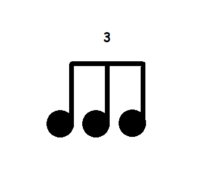
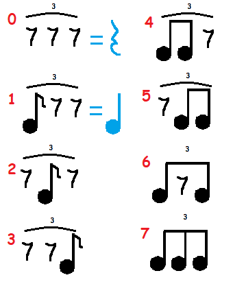

Each `Measure` of exercise is composed of one or more `Beats`. Each of those beats is composed of four pieces: A ride cymbal, snare drum, bass drum, and hi-hat rhythm. These are comprised of notes within a triplet:  

Any three portions of the triplet may be played, resulting in the 8 following combinations:  

Notably, rhythm 0 is more commonly represented as a quarter note rest, and rhythm 1 as a quarter note.  

Internal to the project, the integer values 0-7 (corresponding to the rhythms in the above image) are stored to efficiently encode the ride cymbal, snare drum, bass drum, or hi-hat rhythm. Consequently, a single beat is represented by four integers - one for each part of the instrument/each limb.
